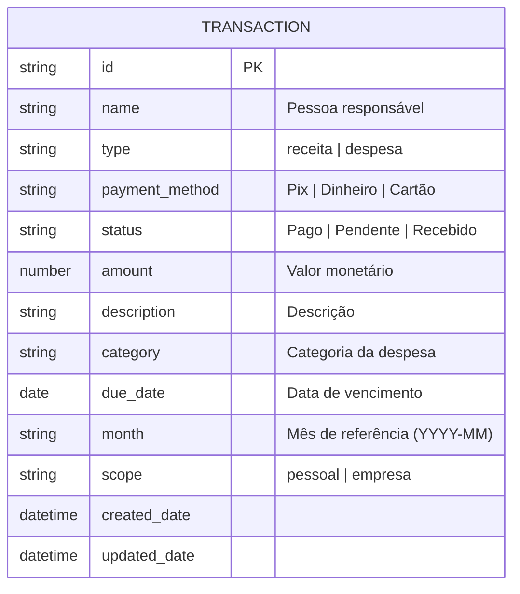
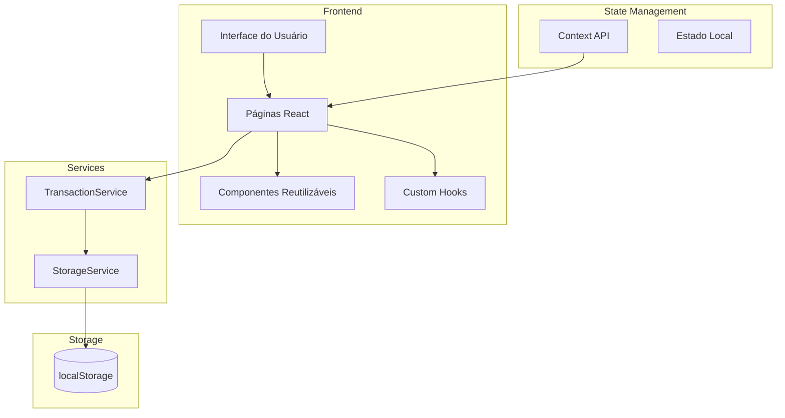
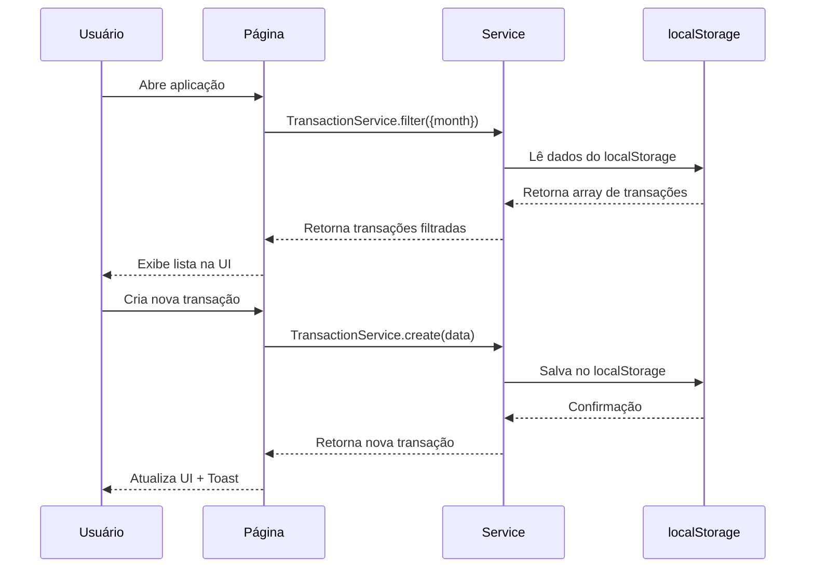

<div align="center">

# Neves Finance

**Controle Financeiro Pessoal**

Um aplicativo web progressivo (PWA) moderno para gestão de finanças pessoais e empresariais.

[](https://reactjs.org/)
[](https://vitejs.dev/)
[](https://tailwindcss.com/)
[](https://www.typescriptlang.org/)
[](LICENSE)

</div>

---

## Índice

- [Objetivo do Sistema](#objetivo-do-sistema)
- [Funcionalidades](#funcionalidades)
- [Regras de Negócio](#regras-de-negócio)
- [Arquitetura da Aplicação](#arquitetura-da-aplicação)
- [Fluxo de Dados](#fluxo-de-dados)
- [Tecnologias Utilizadas](#tecnologias-utilizadas)
- [Estrutura de Diretórios](#estrutura-de-diretórios)
- [Componentes Principais](#componentes-principais)
- [Modelo de Dados](#modelo-de-dados)
- [APIs e Serviços](#apis-e-serviços)
- [Variáveis de Ambiente](#variáveis-de-ambiente)
- [Instalação](#instalação)
- [Build e Deploy](#build-e-deploy)
- [Boas Práticas Adotadas](#boas-práticas-adotadas)
- [Screenshots](#screenshots)

---

## Objetivo do Sistema

O **Neves Finance** é uma aplicação de controle financeiro pessoal projetada para:

- **Registrar transações** financeiras (receitas e despesas)
- **Categorizar gastos** para melhor visualização
- **Acompanhar o fluxo de caixa** mensal
- **Gerenciar múltiplas pessoas** vinculadas às transações
- **Oferecer experiência mobile-first** como PWA instalável

---

## Funcionalidades

| Funcionalidade | Descrição |
|----------------|-----------|
| Dashboard | Painel com resumo financeiro mensal, saldo, receitas e despesas |
| Transações | CRUD completo de transações com filtros e busca |
| Pessoas | Visualização agregada por pessoa responsável |
| Tema | Suporte a tema claro, escuro e automático (sistema) |
| PWA | Instalável como app nativo em dispositivos móveis |
| Pull-to-Refresh | Atualização por gesto de arrastar para baixo |

---

## Regras de Negócio

### Transações



### Validações

| Campo | Obrigatório | Restrições |
|-------|-------------|------------|
| `name` | Sim | Deve estar em `PEOPLE_OPTIONS` |
| `type` | Sim | Enum: `receita`, `despesa` |
| `amount` | Sim | Número positivo |
| `description` | Sim | Texto livre |
| `month` | Sim | Formato `YYYY-MM` |
| `status` | Não | Default: `Pendente` |
| `scope` | Não | Default: `pessoal` |

### Categorias Disponíveis

| Categoria | Descrição |
|-----------|-----------|
| Moradia | Aluguel, condomínio, IPTU |
| Alimentação | Supermercado, restaurantes |
| Transporte | Combustível, uber, transporte público |
| Lazer | Entretenimento, hobbies |
| Saúde | Farmácia, consultas |
| Outros | Demais despesas |

---

## Arquitetura da Aplicação

### Visão Geral



### Padrões Arquiteturais

| Padrão | Aplicação |
|--------|-----------|
| **Component-Based** | Componentes React reutilizáveis |
| **Service Layer** | Abstração de acesso a dados |
| **Custom Hooks** | Lógica reutilizável (pull-to-refresh, mobile detection) |
| **Provider Pattern** | ThemeProvider, AuthProvider, QueryClientProvider |
| **Compound Components** | shadcn/ui components |

---

## Fluxo de Dados



---

## Tecnologias Utilizadas

### Core

| Tecnologia | Versão | Propósito |
|------------|--------|----------|
| React | 18.2 | Framework UI |
| Vite | 6.1 | Build tool |
| React Router | 6.26 | Roteamento SPA |
| TailwindCSS | 3.4 | Estilização utility-first |

### State & Data

| Tecnologia | Propósito |
|------------|-----------|
| React Context | Estado global (tema, auth) |
| TanStack Query | Cache e sincronização de dados |
| localStorage | Persistência offline |

### UI/UX

| Tecnologia | Propósito |
|------------|----------|
| shadcn/ui | Componentes Radix + Tailwind |
| Framer Motion | Animações fluidas |
| Lucide React | Ícones SVG |
| Vaul | Drawer mobile-first |

### PWA

| Tecnologia | Propósito |
|------------|----------|
| vite-plugin-pwa | Service Worker + Manifest |

---

## Estrutura de Diretórios

```
neves-finance/
├── public/
│   ├── icons/                    # Ícones PWA
│   │   ├── apple-touch-icon.png
│   │   ├── favicon-32.png
│   │   ├── icon-192.png
│   │   └── icon-512.png
│   └── manifest.json             # PWA Manifest
│
├── src/
│   ├── api/
│   │   └── base44Client.js       # Cliente API (mock)
│   │
│   ├── components/
│   │   ├── finance/              # Componentes de negócio
│   │   │   ├── BottomNav.jsx
│   │   │   ├── MobileHeader.jsx
│   │   │   ├── MobileSelect.jsx
│   │   │   ├── MonthSelector.jsx
│   │   │   ├── PullRefreshIndicator.jsx
│   │   │   ├── SummaryCard.jsx
│   │   │   ├── TransactionForm.jsx
│   │   │   └── TransactionItem.jsx
│   │   │
│   │   └── ui/                   # shadcn/ui components
│   │       ├── button.jsx
│   │       ├── dialog.jsx
│   │       ├── drawer.jsx
│   │       └── ... (40+ componentes)
│   │
│   ├── hooks/
│   │   ├── use-mobile.jsx        # Detecção mobile
│   │   └── usePullToRefresh.js   # Pull-to-refresh gesture
│   │
│   ├── lib/
│   │   ├── app-params.js         # Parâmetros da URL
│   │   ├── AuthContext.jsx       # Contexto de autenticação
│   │   ├── finance-utils.js      # Utilitários financeiros
│   │   ├── PageNotFound.jsx      # Página 404
│   │   ├── query-client.js       # React Query config
│   │   ├── ThemeProvider.jsx     # Tema (light/dark/system)
│   │   └── utils.js              # Re-exports utils
│   │
│   ├── pages/
│   │   ├── Home.jsx              # Dashboard principal
│   │   ├── People.jsx            # Visão por pessoa
│   │   ├── Settings.jsx          # Configurações
│   │   └── Transactions.jsx      # Lista de transações
│   │
│   ├── services/
│   │   ├── StorageService.js     # Abstração localStorage
│   │   └── TransactionService.js # Lógica de transações
│   │
│   ├── App.jsx                   # Componente raiz
│   ├── index.css                 # Estilos globais + Tailwind
│   └── main.jsx                  # Entry point
│
├── entities/
│   └── Transaction               # Schema JSON da entidade
│
├── .env                          # Variáveis de ambiente
├── components.json               # Config shadcn/ui
├── jsconfig.json                 # Config TypeScript/paths
├── package.json                  # Dependências
├── tailwind.config.js            # Config Tailwind
└── vite.config.js               # Config Vite + PWA
```

---

## Componentes Principais

### Pages

| Componente | Rota | Descrição |
|------------|------|-----------|
| `Home` | `/` | Dashboard com saldo, cards resumo e gráfico pizza |
| `Transactions` | `/transactions` | Lista filtrada de transações com CRUD |
| `People` | `/people` | Agregação por pessoa responsável |
| `Settings` | `/settings` | Tema, instalação PWA, exclusão de dados |

### Finance Components

| Componente | Responsabilidade |
|------------|-----------------|
| `BottomNav` | Navegação inferior com histórico por tab |
| `TransactionForm` | Formulário de criação/edição de transações |
| `TransactionItem` | Item individual da lista com ações |
| `SummaryCard` | Card de resumo (receber, pagar, etc.) |
| `MonthSelector` | Navegação entre meses |
| `MobileSelect` | Select adaptativo (drawer em mobile) |
| `PullRefreshIndicator` | Indicador visual de pull-to-refresh |

---

## Modelo de Dados

### Transaction

```typescript
interface Transaction {
  id: string;                    // ID único gerado
  name: string;                  // Pessoa responsável
  type: 'receita' | 'despesa';   // Tipo da transação
  payment_method: 'Pix' | 'Dinheiro' | 'Cartão';
  status: 'Pago' | 'Pendente' | 'Recebido';
  amount: number;                // Valor em BRL
  description: string;           // Descrição livre
  category: string;              // Categoria (despesas)
  due_date: string;              // Data vencimento (YYYY-MM-DD)
  month: string;                 // Referência (YYYY-MM)
  scope: 'pessoal' | 'empresa';  // Escopo
  created_date: string;          // ISO timestamp
  updated_date: string;          // ISO timestamp
}
```

---

## APIs e Serviços

### StorageService

```javascript
// Chave prefixada para evitar colisões
const PREFIX = 'dolce_';

StorageService.list(key, sort?)        // Lista todos
StorageService.filter(key, query)      // Filtra por critérios
StorageService.create(key, data)       // Cria novo registro
StorageService.update(key, id, data)   // Atualiza existente
StorageService.delete(key, id)         // Remove registro
StorageService.clear(key)              // Limpa todos
```

### TransactionService

```javascript
const KEY = 'transactions';

TransactionService.list(sort?)         // Lista transações
TransactionService.filter(query, sort) // Filtra por mês, etc.
TransactionService.create(data)        // Nova transação
TransactionService.update(id, data)    // Edita transação
TransactionService.delete(id)          // Remove transação
TransactionService.clearAll()          // Limpa todas
```

---

## Variáveis de Ambiente

| Variável | Descrição | Exemplo |
|----------|-----------|---------|
| `VITE_SUPABASE_URL` | URL do projeto Supabase | `https://xxx.supabase.co` |
| `VITE_SUPABASE_ANON_KEY` | Chave anônima do Supabase | `eyJhbG...` |

---

## Instalação

### Pré-requisitos

- Node.js >= 18
- npm >= 9

### Passos

```bash
# Clone o repositório
git clone https://github.com/seu-usuario/neves-finance.git
cd neves-finance

# Instale as dependências
npm install

# Configure as variáveis de ambiente
cp .env.example .env
# Edite .env com suas credenciais

# Inicie o servidor de desenvolvimento
npm run dev
```

O aplicativo estará disponível em `http://localhost:5173`

---

## Build e Deploy

### Produção

```bash
# Build otimizado
npm run build

# Preview local do build
npm run preview
```

Os arquivos serão gerados em `dist/`:

```
dist/
├── index.html
├── assets/
│   ├── index-[hash].js
│   └── index-[hash].css
├── sw.js                        # Service Worker
├── workbox-[hash].js
├── manifest.webmanifest
└── icons/                       # Ícones PWA copiados
```

### Deploy

O aplicativo pode ser deployado em qualquer serviço de hosting estático:

| Plataforma | Comando |
|------------|---------|
| Vercel | `vercel --prod` |
| Netlify | Drag & drop do `dist/` |
| GitHub Pages | `gh-pages -d dist` |
| Cloudflare Pages | Conectar repo + `npm run build` |

---

## Boas Práticas Adotadas

### Código

- **Clean Code**: Nomes descritivos, funções pequenas
- **DRY**: Componentes e hooks reutilizáveis
- **SRP**: Responsabilidade única por componente
- **TypeScript-ready**: Tipagem via JSDoc e jsconfig

### Performance

- **Code Splitting**: Dynamic imports (implícito via Vite)
- **Lazy Loading**: Imagens e componentes sob demanda
- **Bundle Analysis**: Monitoramento de tamanho do bundle
- **Memoização**: Uso de hooks como `useMemo` onde apropriado

### UX

- **Mobile-First**: Design responsivo priorizando mobile
- **Offline-First**: PWA com cache de assets
- **Acessibilidade**: Componentes Radix acessíveis por padrão
- **Animações**: Transições suaves com Framer Motion

### PWA

- **Manifest**: Configurado para instalação
- **Service Worker**: Cache automático via Workbox
- **Icon Set**: Ícones para todas as plataformas

---

## Screenshots

### Desktop - Tema Claro
> Dashboard principal com resumo financeiro

### Mobile - Tema Escuro
> Navegação inferior e lista de transações

---

<div align="center">

**Desenvolvido com por Neves Finance**

</div>
